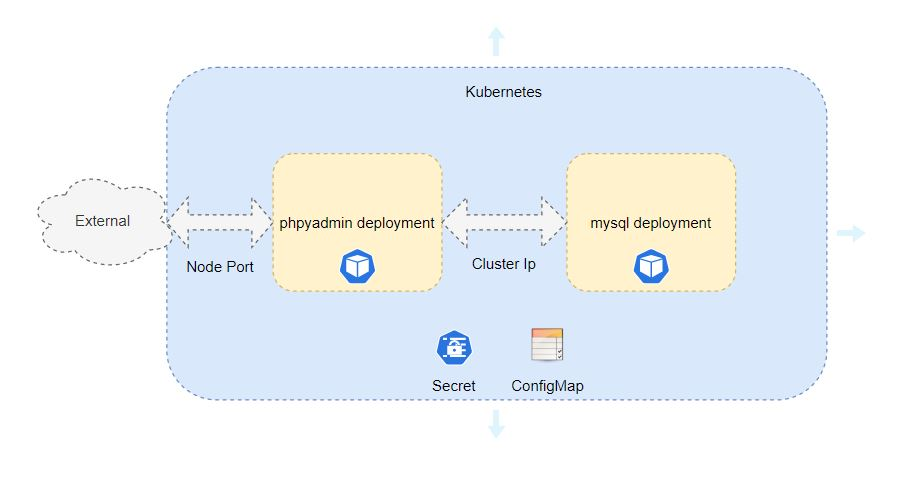

# Deploy phpMyAdmin application on kubernetes

Intend of blog is to explain use of following kubernetes resources using phpMyAdmin application deployment:
- Deployment
- Service
- Secret
- ConfigMap

Before going deep dive into deployment architecture let's first understand this concepts.

### Deployment
Deployments represent a set of multiple, identical Pods with no unique identities. Learn more [here](https://kubernetes.io/docs/concepts/workloads/controllers/deployment/)

### Service
Services are use to group pods together using labels & selectors. Learn more [here](https://kubernetes.io/docs/concepts/services-networking/service/)

### Secret
Secrets are used to store confidential attributes such as password, API key etc. Learn more [here](https://kubernetes.io/docs/concepts/configuration/secret/)

### ConfigMap
ConfigMaps are used to store configuration parameters such hostname, port etc. Learn more [here](https://kubernetes.io/docs/tasks/configure-pod-container/configure-pod-configmap/)

## Architecture



phpMyAdmin application comprises of two components UI (phpMyAdmin) and database (MySQL). 

## Prerequisites:

### Clone github repository
```
git clone https://github.com/sagar-jadhav/kubernetes-essentials.git
```

### Go to `session_1` directory
```
cd ./kubernetes-essentials/session_1/
```

## Step 1: Create demo namespace

```
kubectl create namespace demo
```

## Step 2: Set current namespace to demo

```
kubectl config set-context --current --namespace=demo
```

## Step 3: Create secret db-secret
Store MySQL root password in secret.

```
kubectl create -f secret.yaml
```

## Step 4: Create configmap db-config
Store host & port in configmap

```
kubectl create -f configmap.yaml
```

## Step 5: Create deployment for MySQL

```
kubectl create -f db-deployment.yaml
```
```
kubectl get pods --watch
```
Exit when pod goes into running state


## Step 6: Create service for MySQL
Here service type `ClusterIP` is used so that it is accessible only inside the cluster. 

```
kubectl create -f db-service.yaml
```

## Step 7: Create deployment for phpmyadmin

```
kubectl create -f phpmyadmin-deployment.yaml
```
```
kubectl get pods --watch
```
Exit when pod goes into running state

## Step 8: Create service for phpmyadmin
Here service type `NodePort` is used so that it is accessible outside the cluster. 

```
kubectl create -f phpmyadmin-service.yaml
```

## Step 9: Browse phpmyadmin application

Go to browser and browse http://<IP_ADDRESS>:30030. Login with `root` user & `test` password

here IP_ADDRESS is the ip address of virtual machine where kubernetes is running.
 
## Demo


