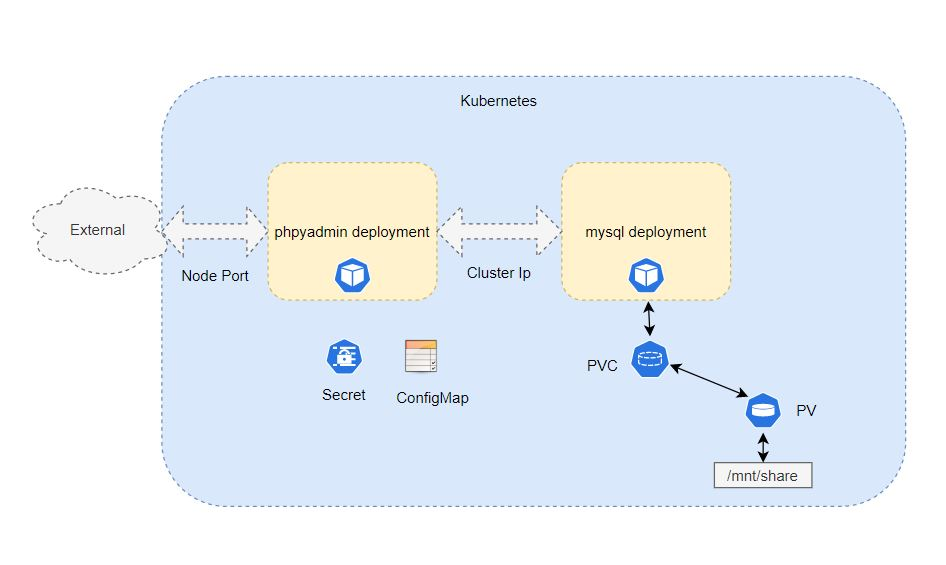
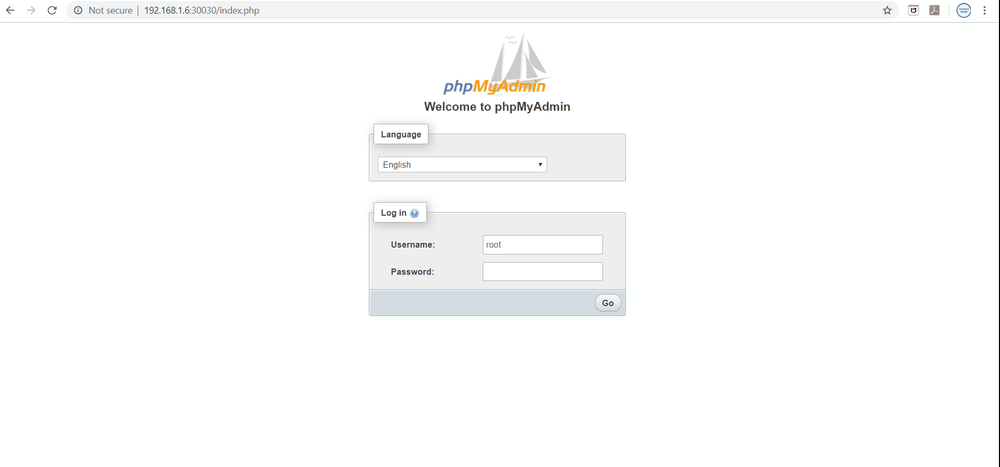
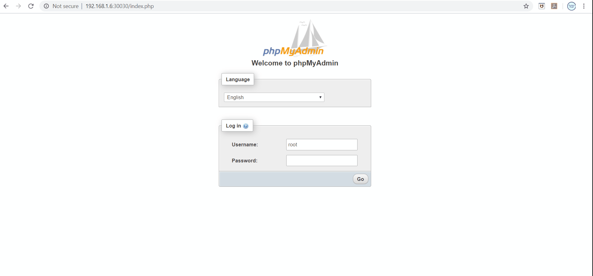

# Use persistent storage for MySQL database

Here, I am covering concepts of `persistent volume` (PV) & `persistent volume claim` (PVC). In the previous [blog](./../session_1/README.md) I have covered how to deploy PHPMyAdmin application in kubernetes. PHPMyAdmin application does not have a persistent storage. Hence If MySQL pod die due to some unexpected error for e.g. resource crunch then data stored in database will also get deleted as data by default stored in pod. Pods by default are stateless in nature. Hence to persist MySQL data `PV` &  `PVC` is required.

### Persistent Volume (PV)
Storage provisioned by administrator. Learn more [here](https://kubernetes.io/docs/concepts/storage/persistent-volumes/)

### Persistent Volume Clain (PVC)
Request for a storage by user. Learn more [here](https://kubernetes.io/docs/concepts/storage/persistent-volumes/)

## Architecture



## Prerequisites:

### Deploy PHPMyAdmin Application
Follow [Deploy phpMyAdmin application on kubernetes](./../session_1/README.md) blog

### Go to session_2 directory
```
cd ../session_2/
```

## Step 1: Create NFS share
Reference:
- https://www.linuxbabe.com/ubuntu/nfs-share
- https://vitux.com/install-nfs-server-and-client-on-ubuntu/

I have created NFS mount at `/mnt/share` location on VM with IP `192.168.1.6`

## Step 2: Create Persistent Volume (PV) 
```
kubectl create -f db-pv.yaml
```

## Step 3: Create Persistent Volume Claim (PVC)
```
kubectl create -f db-pvc.yaml
```

## Step 4: List PV & PVC
```
kubectl get pvc
```
```
kubectl get pv
```

## Step 5: Redeploy MySQL deployment
```
kubectl delete deployment db
```
```
kubectl create -f db-deployment.yaml
```
Here `db-deployment.yaml` is updated YAML with volume & volume mounts. Next watch pods.
```
kubectl get pods -n watch
```
Exit once db pod goes into running state.

## Step 6: Go to mount directory and list files
```
cd /mnt/share
```
```
ls -ltr
```

## Step 7: Browse PHPMyAdmin application and create database


## Step 8: Delete pod
```
kubectl delete pod <MYSQL_DB_POD_NAME>
```

## Step 8: Browse PHPMyAdmin application and verify database still exist



