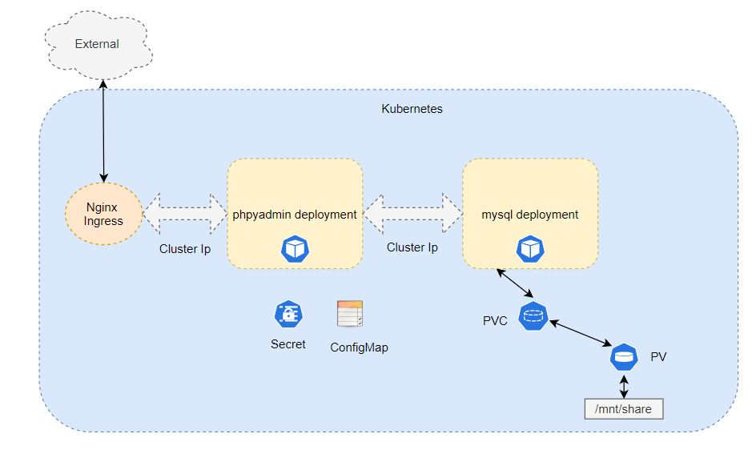

# Expose PHPMyAdmin application to external world

In [Deploy phpMyAdmin application on kubernetes](./../session_1/README.md) blog I used `NodePort` service type to expose application to external world but disadvantage with that approach is `port` needs to be exposed on each node and there is a dependency on external load balancer for load balancing requests, custom hostname and SSL/TLS encryption support etc. With the help of `Ingress` controllers I can eliminate dependency on external load balancer. In this blog I am using `Nginx Ingress` controller to expose PHPMyAdmin application to external world. Learn more about ingress controller [here](https://kubernetes.io/docs/concepts/services-networking/ingress/) 

## Architecture



## Prerequisites:

### Deploy PHPMyAdmin Application
Follow [Deploy phpMyAdmin application on kubernetes](./../session_1/README.md) blog

### Go to session_2 directory
```
cd ../session_3/
```

## Step 1: Enable Nginx ingress controller
```
minikube addons enable ingress
```
```
kubectl get pods --watch -n kube-system
```
Exit once controller pod goes into running state

This step is valid only for `Minikube`. Check steps to enable `Nginx Ingress` controller on `Kubernetes` [here](https://www.nginx.com/products/nginx/kubernetes-ingress-controller/)

## Step 2: Delete PHPMyAdmin NodePort service
```
kubectl delete svc phpmyadmin
```

## Step 3: Deploy PHPMyAdmin ClusterIP service
```
kubectl create -f phpmyadmin-service.yaml
```

## Step 4: Deploy PHPMyAdmin Ingress rule
```
kubectl create -f phpmyadmin-ingress.yaml
```
```
kubectl get ingress --watch
```
Exit once address gets populated

## Step 5: Update hosts file custome hostname
Add below entry in /etc/hosts
```
<INGRESS_ADDRESS> myapp.xyz
```
Get <INGRESS_ADDRESS> from `kubectl get ingress`

## Step 6: Browse PHPMyAdmin application using custom hostname
Go to browser and browse http://myapp.xyz

