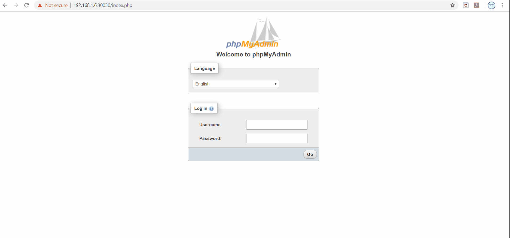

# Adding probes to PHPMyAdmin application

Kubernetes uses `Readiness` & `Liveness` probes to manage pod lifecycle. Readiness probe is used to determine whether pod is ready to accept the traffic or not and liveness probe is used to determine whether pod is functioning properly or not. Read more about them [here](https://kubernetes.io/docs/tasks/configure-pod-container/configure-liveness-readiness-startup-probes/). In this blog I am adding readiness & liveness probe to PHPMyAdmin application.

## Architecture


## Prerequisites:

### Deploy PHPMyAdmin Application
Follow [Deploy phpMyAdmin application on kubernetes](./../session_1/README.md) blog

### Go to session_4 directory
```
cd ../session_4/
```

## Step 1: Delete PHPMyAdmin deployment
```
kubectl delete deployment phpmyadmin
```

## Step 2: Deploy PHPMyAdmin deployment with Readiness & Liveness probes
```
kubectl create -f phpmyadmin-deployment.yaml
```
```
kubectl get pods --watch
```
Exit once pod goes into running state

## Step 9: Browse phpmyadmin application

Go to browser and browse http://<IP_ADDRESS>:30030. Login with `root` user & `test` password

here IP_ADDRESS is the ip address of virtual machine where kubernetes is running.
 
## Demo

