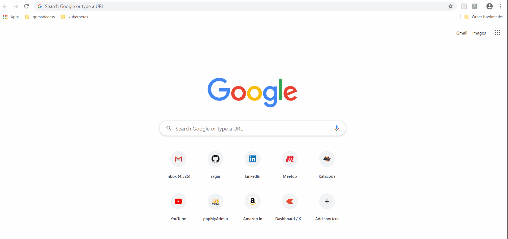

# Deploying PHPMyAdmin application using Helm Chart

Let's learn How to deploy PHPMyAdmin application using helm chart? Learn more about helm [here](https://helm.sh/).

## Prerequisites:

### Create NFS share
Reference:
- https://www.linuxbabe.com/ubuntu/nfs-share
- https://vitux.com/install-nfs-server-and-client-on-ubuntu/

### Install Helm
Refer installation guide [here](https://helm.sh/docs/intro/install/)

### Clone github repository
```
git clone https://github.com/sagar-jadhav/kubernetes-essentials.git
```

### Go to `session_5` directory
```
cd ./kubernetes-essentials/session_5/
```

## Enable Nginx ingress controller
```
minikube addons enable ingress
```
```
kubectl get pods --watch -n kube-system
```
Exit once controller pod goes into running state

## Step 1: Create PHPMyAdmin helm chart
```
helm create phpmyadmin
```

## Step 2: Add all application YAML files to templates directory
Remove unwanted files from template directory
```
rm -rf ./phpmyadmin/templates/*
```
Copy YAML files
```
cp configmap.yaml db-deployment.yaml db-pv.yaml db-pvc.yaml db-service.yaml secret.yaml phpmyadmin-deployment.yaml phpmyadmin-ingress.yaml phpmyadmin-service.yaml ./phpmyadmin/templates/
```

## Step 3: Package helm chart
```
helm package phpmyadmin
```

## Step 4: Deploy PHPMyAdmin application
```
helm install phpmyadmin ./phpmyadmin-0.1.0.tgz
```

## Step 5: List helm release
```
helm ls
```

## Step 6: List pods
```
kubectl get pods
```

## Step 7: Browse PHPMyAdmin application using custom hostname
Go to browser and browse http://myapp.xyz


## Step 8: Remove PHPMyAdmin application
```
helm uninstall phpmyadmin
```

